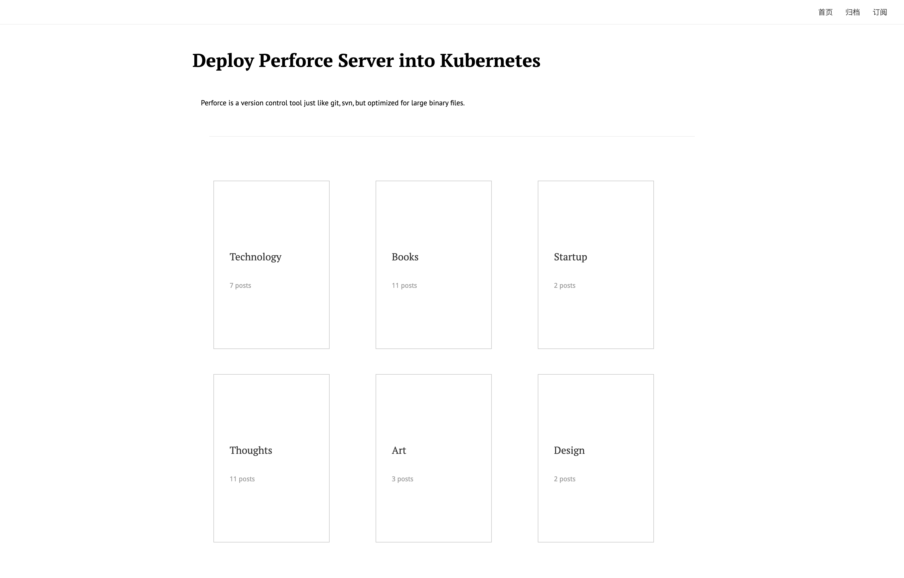

# Blog

My personal blog implementing the Classify theme of [Farbox](https://github.com/hepochen/FarBox), written with Nuxt3

I do this because Farbox is not longer updated and maintained, but my blog needs to do so



## Features

- RSS feed at `/feed`
- Markdown
- Mathjax
- i18n
- Archive group by year
- giscus comment system
- plausible analytics
- neodb.social collections

## Setup

### Edit Config

In `nuxt.config.ts`, input your `host`

### Add Your Content

- Categories are dirs under `content` folder
- Articles are under categories whose filenames end with `.md`

An example article:

```
---
date: 2015-02-04 20:31
status: public
title: Your Title
---

You content goes here

```

Make `status` private will hide your article

- Images should be put under `public`

### Deploy

vercel, netlify, self made image with `Dockerfile`, you name it.